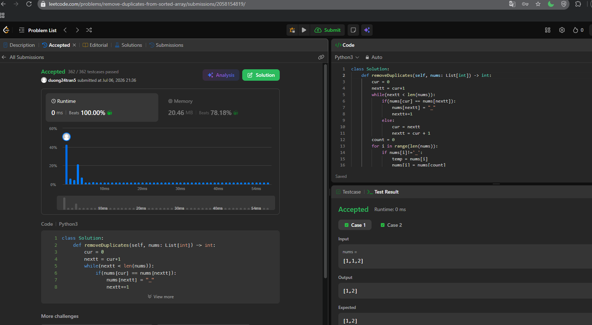

26. Remove Duplicates from Sorted Array
bài này đơn gian thôi , 
tôi sẽ cần phải xóa các phần tử trùng nhau trong mảng số nguyên
tôi dùng 2 con trỏ cur và next 
dùng vòng lặp kiểm tra nums[cur] = nums[next]? -> gán nums[next] = '_'
sau đó tôi dồn phần tử '_' xuống cuối mảng, trả về count vì đề bài yêu cầu
